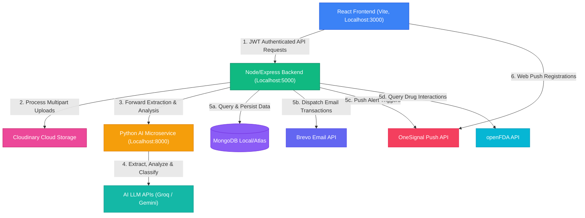
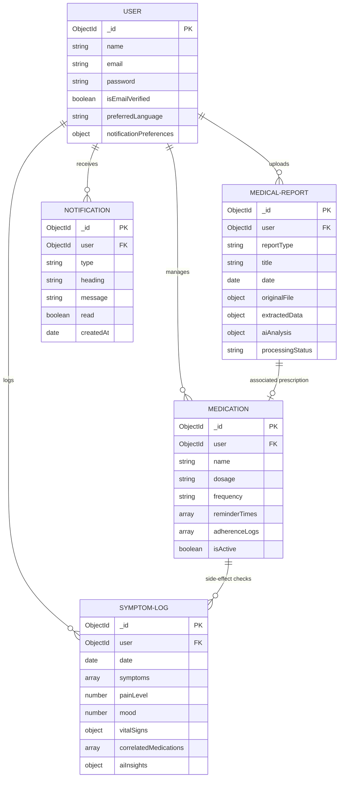
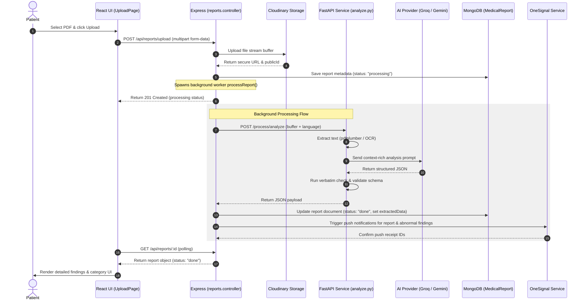
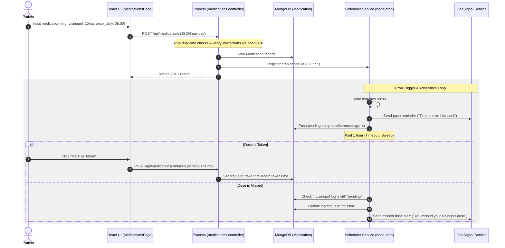
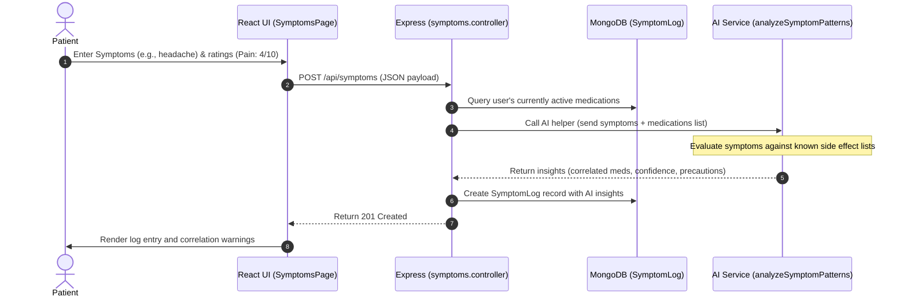

# MedIntel — Full Codebase & Data-Flow Walkthrough

This document serves as the single authoritative technical reference for the MedIntel healthcare platform. It provides a detailed, file-by-file inventory of the system's architecture, data models, routing endpoints, background schedulers, AI processing pipelines, and user flows.

---

## 1. Executive Summary

MedIntel is a full-stack, AI-powered healthcare application that helps users extract, summarize, and track clinical data from uploaded medical reports, manage prescription schedules, log symptoms, check for drug interactions, and visualize health trends over time.

### Technical Stack Summary
- **Frontend**: React (v18.2.0), Vite, TailwindCSS (utility classes), Lucide Icons, Recharts (for trend plotting), React Router DOM (v6).
- **Backend Node Service**: Node.js, Express.js, MongoDB (Mongoose Object Modeling), JSON Web Tokens (JWT), Node-cron, Axios, Multer.
- **AI Processing Microservice**: Python (v3.10+), FastAPI, Uvicorn, Google Gemini API SDK (`google-generativeai`), Groq Python SDK (`groq`), pdfplumber (text extraction from PDFs), Pillow, PyTesseract (OCR fallback).
- **External Services**:
  - **Brevo SMTP (SMTP API)**: Used for email verification, password reset, and weekly summary emails.
  - **OneSignal REST API**: Used for cross-platform in-app and push notification delivery.
  - **Cloudinary REST API**: Used for secure cloud storage of uploaded medical PDFs and images.
  - **openFDA API**: Querying clinical records for drug-drug interactions.

### AI Safety & Scope Boundaries
All AI prompts and system instructions in this codebase (both `backend/src/services/aiService.js` and `ai-service/app/processors/analyze.py`) strictly enforce the following safety rules:
1. **No Diagnosis**: Under no circumstances should the AI diagnose diseases. It must only explain the clinical significance of measurements in plain, patient-friendly language.
2. **No Prescription**: The AI is forbidden from recommending, prescribing, or modifying medication courses.
3. **Verbatim Validation**: The AI must check numeric output values against the raw text content to minimize hallucination risks, flagging low confidence for unverified numbers.
4. **Calm Language**: The AI must use non-alarming, patient-friendly language, suggesting that concerning values are "worth discussing with a doctor" rather than stating "see a doctor immediately."

---

## 2. High-Level Architecture Diagram



---

## 3. Full Repository Tree

```
medical-care-app/
├── CODEBASE_WALKTHROUGH.md               # [THIS FILE] Authoritative codebase structure and architecture guide
├── README.md                             # Quick-start documentation and overview of prerequisites
├── prompt.md                             # Original specifications and formatting instructions for the walkthrough
├── generator.py                          # Mock report and text generator for testing purposes
├── shared/
│   └── categorySchemas.json              # Defined schemas for report types (blood_test, imaging, ecg, prescription, summary)
├── ai-service/
│   ├── .env                              # Environment keys for AI service (GROQ_API_KEY, GEMINI_API_KEY, models)
│   ├── requirements.txt                  # Python library requirements (fastapi, uvicorn, pdfplumber, pytesseract)
│   └── app/
│       ├── __init__.py                   # Standard package initialization file
│       ├── main.py                       # FastAPI entry point defining extraction, analysis, Q&A, and interaction endpoints
│       └── processors/
│           ├── __init__.py               # Package initialization
│           ├── extract.py                # File parsing routing (pdfplumber for PDFs, pytesseract for images)
│           └── analyze.py                # Multi-stage AI parsing, few-shot prompting, and JSON structure verification
├── backend/
│   ├── server.js                         # Node.js entry point, middleware registration, MongoDB connection and scheduler init
│   ├── package.json                      # Backend dependency config (express, mongoose, node-cron, express-rate-limit)
│   ├── .env                              # Environment settings (JWT_SECRET, MONGODB_URI, BREVO_API_KEY, Cloudinary, etc.)
│   ├── src/
│   │   ├── controllers/
│   │   │   ├── auth.controller.js        # Authentication workflows, email verification, password reset, and profile deletion
│   │   │   ├── medications.controller.js  # Prescription courses, adherence logs, interaction audits, and scheduler changes
│   │   │   ├── reports.controller.js     # Multipart file processing, background AI dispatch, trend merges, and comparisons
│   │   │   └── symptoms.controller.js    # Symptom recording, active medication correlation, and charts history query
│   │   ├── middleware/
│   │   │   ├── auth.middleware.js        # JWT header validation and decoding to populate req.user context
│   │   │   ├── security.middleware.js    # Rate limits definitions, Mongo injection sanitizing, helmet headers, XSS prevention
│   │   │   ├── upload.middleware.js      # Multer memory storage and Cloudinary secure URL upload/destroy streams
│   │   │   └── validate.middleware.js    # Express-validator result parser returning detailed bad-request feedback
│   │   ├── models/
│   │   │   ├── User.js                   # Mongoose Schema detailing user attributes, secure hashes, and notification preferences
│   │   │   ├── MedicalReport.js          # Mongoose Schema detailing processed report metadata, raw texts, and AI analyses
│   │   │   ├── Medication.js             # Mongoose Schema detailing drug details, Cron timing, and adherence log entries
│   │   │   ├── SymptomLog.js             # Mongoose Schema detailing vital signs, severity ratings, and AI side-effect insights
│   │   │   └── Notification.js           # Mongoose Schema detailing type-specific message alerts with automated 30-day TTL indexes
│   │   ├── routes/
│   │   │   ├── ai.routes.js              # Endpoint maps for translations, text-only analyses, entity extraction, and Q&A
│   │   │   ├── auth.routes.js            # Endpoints mapping register, login, profiles, updates, and verify actions
│   │   │   ├── medications.routes.js     # Endpoints mapping schedule listings, adherence logging, and deactivation
│   │   │   ├── notifications.routes.js   # Endpoints mapping read flags updates, page lists, and item deletions
│   │   │   ├── reports.routes.js         # Endpoints mapping uploads, details, comparisons, and re-translations
│   │   │   ├── symptoms.routes.js        # Endpoints mapping daily logs entries and numeric charting histories
│   │   │   └── timeline.routes.js        # Unified events merge/sort, clinician summary compile, and stats dashboards
│   │   ├── services/
│   │   │   ├── aiService.js              # Local Node.js AI analyzer, translation, and openFDA drug interaction fallback service
│   │   │   ├── notificationService.js    # OneSignal push dispatcher and local MongoDB alert logging coordinator
│   │   │   ├── reportProcessingService.js# Local helper for OCR, simple ranges checks, and static medication parsing fallback
│   │   │   └── schedulerService.js       # Node-cron schedule triggers for medication doses, daily check-ins, and sweeps
│   │   └── utils/
│   │       ├── sendEmail.js              # SMTP client using Brevo REST API endpoints for transactional emailing
│   │       └── validateEnv.js            # Critical environment check executed on server startup to block bad executions
│   └── tests/                            # Comprehensive backend test suite containing unit, integration, and mock suites
└── frontend/
    ├── vite.config.js                    # Vite configuration setting server port to 3000 and proxying /api to port 5000
    ├── package.json                      # Frontend configurations detailing dependencies (recharts, date-fns, lucide)
    ├── index.html                        # Application entry DOM frame importing OneSignal loader script
    └── src/
        ├── main.jsx                      # App root initialization containing window.OneSignalDeferred bootstrap hook
        ├── App.jsx                       # Routing tree separating public guards from Layout-wrapped protected endpoints
        ├── index.css                     # Global design themes variables mapping colors and custom fonts (Inter)
        ├── context/
        │   └── AuthContext.jsx           # Global React Context tracking user states, JWT persistence, and OneSignal logins
        ├── services/
        │   └── api.js                    # Axios instance with request JWT interceptor and 401 response auto-logout hooks
        ├── components/
        │   ├── AuthGuard.jsx             # Active session guard validating authentication or redirecting to /login
        │   ├── ErrorBoundary.jsx         # Global error boundary to capture React lifecycle crashes and print user-friendly alerts
        │   ├── Layout.jsx                # Flex grid app shell containing Responsive Header, Sidebar Navigation, and Outlet
        │   ├── Navbar.jsx                # Upper navigation header providing responsive options and profile dropdowns
        │   ├── NotificationBell.jsx      # In-app alert bell pulling database lists and polling every 30 seconds
        │   ├── Sidebar.jsx               # Left-side navigation mapping routes with matching icons
        │   └── ui/
        │       ├── EmptyState.jsx        # Standardized empty page layout offering custom icon, description, and action button
        │       ├── PageLoader.jsx        # Simple full-center spinner shown during heavy page loads
        │       ├── SkeletonCard.jsx      # Shimmer box list indicator shown during fetch cycles
        │       ├── StatCard.jsx          # Dashboard card compiling stat values, descriptions, and icon styles
        │       └── StatusBadge.jsx       # Standardized capsule pill styling status badges (Normal, Borderline, Abnormal)
        └── pages/                        # Individual page modules (DashboardPage, MedicationsPage, ReportDetailPage, etc.)
```

---

## 4. Backend Walkthrough (Node/Express)

The Express backend coordinates user data, persists files, manages notifications, checks interactions, and schedules background cron checks.

### Entity Relationship Diagram (ERD)



### Models Checklist

| Model | Schema Fields | Key Indices | Virtuals & Middlewares |
| :--- | :--- | :--- | :--- |
| [User.js](file:///c:/Users/Aksh/Downloads/medical-care-app/backend/src/models/User.js) | `name`, `email`, `password`, `isEmailVerified`, `verificationToken`, `resetPasswordToken`, `resetPasswordExpire`, `dateOfBirth`, `gender`, `bloodGroup`, `phone`, `emergencyContact`, `allergies`, `chronicConditions`, `healthConditions`, `preferredLanguage`, `notificationPreferences` (with `dailyCheckIn` and `weeklySummary` defaults), `loginAttempts`, `lockUntil` | `{ email: 1 }` (unique) | `pre('save')` hashes password (cost: 12). Methods `comparePassword`, `getResetPasswordToken`, `getVerificationToken`. Virtual `isLocked`. |
| [MedicalReport.js](file:///c:/Users/Aksh/Downloads/medical-care-app/backend/src/models/MedicalReport.js) | `user`, `reportType`, `title`, `date`, `hospital` (`name`, `location`), `doctor` (`name`, `specialization`), `originalFile`, `fileType`, `extractedText`, `rawText`, `language`, `extractedData` (dynamic fields like `testResults`, `medications`, `findings`, `heartRate`), `aiAnalysis` (`simplifiedExplanation`, `urgencyLevel`), `processingStatus`, `tags`, `isArchived` | `{ user: 1, date: -1 }`<br>`{ user: 1, reportType: 1 }` | `timestamps: true` enabled. |
| [Medication.js](file:///c:/Users/Aksh/Downloads/medical-care-app/backend/src/models/Medication.js) | `user`, `name`, `genericName`, `dosage`, `unit`, `frequency`, `timing`, `customSchedule`, `reminderTimes`, `startDate`, `endDate`, `prescribedBy`, `prescriptionReport`, `sideEffects`, `warnings`, `notes`, `interactions`, `reminderSettings`, `adherenceLogs` (array of logs with `scheduledTime`, `takenTime`, `status`), `isActive` | `{ user: 1, isActive: 1 }`<br>`{ user: 1, startDate: -1 }` | `timestamps: true` enabled. |
| [SymptomLog.js](file:///c:/Users/Aksh/Downloads/medical-care-app/backend/src/models/SymptomLog.js) | `user`, `date`, `symptom`, `symptoms` (array with `name`, `severity`, `notes`), `severity`, `painLevel`, `mood`, `energyLevel`, `sleepQuality`, `appetite`, `vitalSigns`, `medicationsTaken`, `notes`, `correlatedMedications` (array with `medication`, `possibleSideEffect`, `confidence`), `aiInsights` | `{ user: 1, date: -1 }` | `timestamps: true` enabled. |
| [Notification.js](file:///c:/Users/Aksh/Downloads/medical-care-app/backend/src/models/Notification.js) | `user`, `type`, `heading`, `message`, `url`, `read`, `data`, `createdAt` | `{ user: 1 }`<br>`{ createdAt: 1 }` (with TTL expire) | Index on `createdAt` with `expireAfterSeconds: 2592000` (automatic purge after 30 days). |

---

### Route Reference Tables

#### Auth Routes (`/api/auth`)
All payload checks use validation rules mapped in [auth.routes.js](file:///c:/Users/Aksh/Downloads/medical-care-app/backend/src/routes/auth.routes.js).

| Method | Path | Auth Required? | Request Shape | Response Shape | Internal Logic Summary |
| :--- | :--- | :--- | :--- | :--- | :--- |
| `POST` | `/register` | No | `{ name, email, password, gender, phone }` | `{ success: true, message: string, data: { user, token } }` | Validates strings, asserts email uniqueness, creates `User`, hashes pass, sends Brevo verify email, registers external user ID on OneSignal. |
| `POST` | `/login` | No | `{ email, password }` | `{ success: true, data: { user, token } }` | Checks locks, counts failed logs. Compares hashes. If 5 failures, locks account for 15 minutes. Re-identifies user on OneSignal on success. |
| `POST` | `/logout` | Yes | None | `{ success: true, message: string }` | Simple client success callback. |
| `GET` | `/me` | Yes | None | `{ success: true, data: { user } }` | Decodes JWT, finds user by ID, returns fields. |
| `PUT` | `/profile` | Yes | `{ name, phone, allergies, preferedLanguage, notificationPreferences }` | `{ success: true, data: { user } }` | Filters request keys, unsets empty strings to prevent schema crashes, saves database edits, runs validation, triggers daily check-in rescheduling if cron settings changed. |
| `DELETE` | `/profile` | Yes | None | `{ success: true, message: string }` | Cascading removal: deletes files from Cloudinary, then removes reports, medications, symptoms, and user records. |
| `POST` | `/forgot-password`| No | `{ email }` | `{ success: true, message: string }` | Resolves email, hashes reset token, saves expiration (10 min), logs console password reset link, fires Brevo template. |
| `PUT` | `/reset-password/:token`| No | `{ password }` | `{ success: true, data: { user, token } }` | Validates hash match against DB token, asserts expiration, hashes new password, unsets reset fields, registers fresh JWT. |
| `GET` | `/verify-email/:token`| No | None | `{ success: true, message: string }` | Resolves hashed token, updates `isEmailVerified` to `true`, unsets token fields. |

#### Reports Routes (`/api/reports`)
Mapped in [reports.routes.js](file:///c:/Users/Aksh/Downloads/medical-care-app/backend/src/routes/reports.routes.js).

| Method | Path | Auth Required? | Request Shape | Response Shape | Internal Logic Summary |
| :--- | :--- | :--- | :--- | :--- | :--- |
| `POST` | `/upload` | Yes (Rate-limited) | `multipart/form-data` with `file`, `title`, `language` | `{ success: true, message: string, data: { reportId, processingStatus } }` | Asserts PDF/Image mime-type, streams buffer to Cloudinary, creates DB report entry as `processing`, spawns background worker. |
| `GET` | `/` | Yes | Query params: `page`, `limit`, `reportType` | `{ success: true, count, data: { reports, pagination } }` | Paginated index query for user's active, unarchived reports. Excludes heavy fields (`extractedText`, `rawText`). |
| `GET` | `/trends` | Yes | None | `{ success: true, data: { trends } }` | Iterates all user reports, parses test values, normalizes units (e.g. mmol/L to mg/dL for glucose/lipids), aggregates timeline history by test parameter name. |
| `GET` | `/compare/:id1/:id2`| Yes | None | `{ success: true, data: { report1, report2, differences, onlyInReport1, onlyInReport2 } }` | Fetches both reports, aligns testResults by matching lowercase key, normalizes units, calculates mathematical delta, flags improvements/worsenings. |
| `GET` | `/:id` | Yes | None | `{ success: true, data: { report } }` | Fetches single document by ID, validates user ownership. |
| `PUT` | `/:id` | Yes | `{ tags, isArchived, title }` | `{ success: true, data: { report } }` | Validates ownership, applies title/tag updates. |
| `DELETE` | `/:id` | Yes | None | `{ success: true, message: string }` | Deletes image from Cloudinary, unlinks associated medications, deletes Mongoose record. |

#### Medications Routes (`/api/medications`)
Mapped in [medications.routes.js](file:///c:/Users/Aksh/Downloads/medical-care-app/backend/src/routes/medications.routes.js).

| Method | Path | Auth Required? | Request Shape | Response Shape | Internal Logic Summary |
| :--- | :--- | :--- | :--- | :--- | :--- |
| `POST` | `/` | Yes | `{ name, dosage, frequency, reminderTimes, startDate }` | `{ success: true, data: { medication }, interactions }` | Asserts name & dose, runs duplicate active checks. Runs AI interaction checks via `aiService.checkDrugInteractions()`, populates default frequency map if no custom times sent, saves, registers cron reminders. |
| `GET` | `/` | Yes | Query params: `page`, `limit`, `active` | `{ success: true, data: { medications, pagination } }` | Paginated medication course fetch. |
| `GET` | `/active` | Yes | None | `{ success: true, data: { medications } }` | Returns active user medication list. |
| `GET` | `/schedule` | Yes | None | `{ success: true, data: { schedule } }` | Formulates today's schedule. Maps every active medication's reminderTimes, checks adherence log for match today to mark `taken` status. |
| `GET` | `/interactions/check`| Yes | None | `{ success: true, data: { interactions, message } }` | Gathers active medications. If $\ge 2$, triggers openFDA/local fallback interactions check. |
| `PUT` | `/:id` | Yes | `{ name, dosage, isActive, reminderTimes }` | `{ success: true, data: { medication } }` | Saves updates. If reminder times change, stops active node-cron jobs and rebuilds them. |
| `POST` | `/:id/taken` | Yes | `{ scheduledTime }` | `{ success: true, data: { medication } }` | Appends adherence logs entry with status `taken` and timestamps. |
| `DELETE` | `/:id` | Yes | None | `{ success: true, message: string }` | Soft deactivates medication, unsets `isActive` to `false`, stops active scheduler cron jobs. |

#### Symptoms Routes (`/api/symptoms`)
Mapped in [symptoms.routes.js](file:///c:/Users/Aksh/Downloads/medical-care-app/backend/src/routes/symptoms.routes.js).

| Method | Path | Auth Required? | Request Shape | Response Shape | Internal Logic Summary |
| :--- | :--- | :--- | :--- | :--- | :--- |
| `POST` | `/` | Yes | `{ date, symptoms: [{ name, severity }], mood, energyLevel, vitalSigns }` | `{ success: true, data: { symptomLog } }` | Queries active medications on log date, calls AI pattern analyzer `aiService.analyzeSymptomPatterns()` for drug side effect correlation, saves insights. |
| `GET` | `/` | Yes | Query params: `page`, `limit` | `{ success: true, data: { symptoms, pagination } }` | Paginated symptoms logs history list. |
| `GET` | `/trends/pain`| Yes | Query: `days` | `{ success: true, data: { trends } }` | Gathers pain levels and dates within specified window (default 30 days) sorted chronologically for Recharts plotting. |
| `GET` | `/trends/mood`| Yes | Query: `days` | `{ success: true, data: { trends } }` | Gathers mood strings, maps to scores (excellent=5, very_poor=1) for trend plots. |

#### Timeline Routes (`/api/timeline`)
Mapped in [timeline.routes.js](file:///c:/Users/Aksh/Downloads/medical-care-app/backend/src/routes/timeline.routes.js).

| Method | Path | Auth Required? | Request Shape | Response Shape | Internal Logic Summary |
| :--- | :--- | :--- | :--- | :--- | :--- |
| `GET` | `/` | Yes | Query: `startDate`, `endDate` | `{ success: true, data: { events, counts } }` | Performs concurrent fetch on User Reports, Medications, and Symptom logs. Flattens all entries into a unified timeline event list, sorts by event date. |
| `GET` | `/summary` | Yes | None | `{ success: true, data: { summary } }` | Consolidates reports (last 10), active medications, and symptoms (last 10 entries) from the past 30 days. Compiles text context and passes to LLM via `callAI()` to create a handover note for doctors. |
| `GET` | `/dashboard` | Yes | None | `{ success: true, data: { summary } }` | Gathers stats (reports, active meds count, logs, average pain rating, top 5 frequent symptoms) from the past 30 days. |

#### AI Utility Routes (`/api/ai`)
Mapped in [ai.routes.js](file:///c:/Users/Aksh/Downloads/medical-care-app/backend/src/routes/ai.routes.js).

| Method | Path | Auth Required? | Request Shape | Response Shape | Internal Logic Summary |
| :--- | :--- | :--- | :--- | :--- | :--- |
| `POST` | `/translate` | Yes | `{ text, targetLanguage }` | `{ success: true, data: { translatedText } }` | Translates raw clinical parameters texts using the AI service. |
| `POST` | `/qa` | Yes | `{ question, reportId, history }` | `{ success: true, data: { answer } }` | Pulls medical report, constructs text context (testResults, findings, summary), builds prompt enforcing strict rules (no general knowledge, max 150 words), and calls LLM. |
| `POST` | `/retranslate/:id`| Yes | `{ language }` | `{ success: true, data: { report } }` | Controller mapping. Re-runs `aiService.analyzeReport()` on raw text using the new language, updates report's `extractedData` and `aiAnalysis` properties. |

---

## 5. AI Service Walkthrough (Python)

If enabled, the Python microservice (built with **FastAPI**) processes high-throughput AI requests, executing file text extraction and structured parsing.

### Entry Point & Inter-Service Invocation
The Python service is started via:
```bash
uvicorn app.main:app --reload --port 8000
```
The Node.js backend invokes the Python service by dispatching standard HTTP `POST` requests to `http://localhost:8000/process/analyze` using the `form-data` library, passing the raw file buffer, filename, and target language.

### Processors Map

#### 1. Text Extractor ([extract.py](file:///c:/Users/Aksh/Downloads/medical-care-app/ai-service/app/processors/extract.py))
- **PDF Extraction**: Reads the file buffer using `pdfplumber`. If text characters are extracted, it returns them. If a page's extracted text is empty or too short ($<20$ characters), it renders the page layout at 150 DPI and triggers `pytesseract` OCR to extract text from the rendered page image.
- **Image Extraction**: Utilizes Python Imaging Library (Pillow) to open image streams, running `pytesseract.image_to_string()` for OCR. If `pytesseract` is missing or fails, it returns image metadata (dimensions, format) as placeholder text for the LLM to process.

#### 2. Clinical Parser ([analyze.py](file:///c:/Users/Aksh/Downloads/medical-care-app/ai-service/app/processors/analyze.py))
- **`call_ai`**: Unified caller. It attempts to call the Groq SDK (`llama-3.3-70b-versatile` by default) first. If it encounters a rate limit (HTTP 429), it retries with exponential backoff. If it hits a token length error (HTTP 413) or exhausts all 3 Groq attempts, it falls back to the Google Gemini API SDK (`gemini-1.5-flash` or the configured model).
- **`auto_detect_report_type`**: Classifies report text into one of seven categories (`blood_test`, `urine_test`, `imaging`, `ecg`, `prescription`, `discharge_summary`, or `other`) using a short LLM prompt.
- **`get_category_instructions`**: Returns category-specific prompts (e.g. telling the LLM to populate `testResults` for blood tests, but to use `medications` array for prescriptions).
- **`validate_against_schema`**: Confirms the LLM's JSON response contains all required fields mapped in `shared/categorySchemas.json` (such as `bodyRegion` for imaging, or `medications` for prescriptions).
- **Verbatim Validation Loop**: If the LLM generates numeric test values (e.g., hemoglobin concentration), the processor checks if that number exists verbatim in the raw extracted text. If not found, it logs a warning and marks the parameter's confidence level as `"low"` to protect against numerical hallucination.
- **`check_drug_interactions`**: Direct prompt checking interactions between a list of active medications and a new candidate.
- **`answer_question`**: Implements RAG for single-report Q&A, formatting context boundaries and resolving the question.

### Node vs. Python Service Reconciliation
This repository contains two AI implementation services: `backend/src/services/aiService.js` and `ai-service/app/main.py` + `app/processors/analyze.py`.
- **Primary Route**: The backend (`reports.controller.js`) attempts to communicate with the Python FastAPI service on `http://localhost:8000` first.
- **Node Fallback Route**: If `PYTHON_AI_URL` is undefined or the Python service is offline/times out, the backend falls back to its local JS services:
  - **Local OCR**: Extracted via Node libraries `pdf-parse` and `tesseract.js` (for images).
  - **Local AI Analysis**: Mapped in `backend/src/services/aiService.js`. This JS utility duplicates the prompt structures, few-shot examples, JSON parsing fallbacks, auto-detection logic, and LLM calls (Groq primary, Gemini fallback).
- **Differences in Logic**:
  - **PDF Parsing**: Python uses `pdfplumber` (which handles tabular coordinates well), whereas Node uses the basic `pdf-parse` library.
  - **Drug Interactions**: The Node service (`aiService.js`) implements a direct call to the external **openFDA API** to fetch interaction warnings, falling back to a local database check if offline. The Python service (`analyze.py`) performs interaction checking entirely via LLM prompts.

---

## 6. Frontend Walkthrough (React/Vite)

The frontend is a single page application built on React, styled with TailwindCSS utilities, and using Recharts for trend rendering.

### App Shell & Routing Table
Configured in [App.jsx](file:///c:/Users/Aksh/Downloads/medical-care-app/frontend/src/App.jsx). It uses `BrowserRouter` with `AuthProvider` and `react-hot-toast`'s `<Toaster>`.
- **Route Protection**: The custom `<AuthGuard>` wrapper checks the global `isAuthenticated` state. If `loading`, it shows a loading spinner. If unauthenticated, it redirects to `/login` via React Router's `<Navigate replace />`.
- **Public Redirects**: The `<PublicOnly>` wrapper prevents logged-in users from accessing landing, login, or registration pages, redirecting them to `/dashboard`.

| Path | Component | Guard Type | Suspense / Lazy Loaded? |
| :--- | :--- | :--- | :--- |
| `/` | `LandingPage` | Public Only | No |
| `/login` | `LoginPage` | Public Only | No |
| `/register` | `RegisterPage` | Public Only | No |
| `/forgot-password` | `ForgotPasswordPage` | Public Only | Yes |
| `/reset-password/:token`| `ResetPasswordPage` | Public Only | Yes |
| `/verify-email/:token` | `EmailVerificationPage` | Mixed (Public/Private) | Yes |
| `/dashboard` | `DashboardPage` | Protected | Yes (Wrapped in ErrorBoundary) |
| `/upload` | `UploadPage` | Protected | Yes (Wrapped in ErrorBoundary) |
| `/reports` | `ReportsListPage` | Protected | Yes (Wrapped in ErrorBoundary) |
| `/reports/compare` | `ReportComparePage` | Protected | Yes (Wrapped in ErrorBoundary) |
| `/reports/:id` | `ReportDetailPage` | Protected | Yes (Wrapped in ErrorBoundary) |
| `/medications` | `MedicationsPage` | Protected | Yes (Wrapped in ErrorBoundary) |
| `/symptoms` | `SymptomsPage` | Protected | Yes (Wrapped in ErrorBoundary) |
| `/trends` | `TrendsPage` | Protected | Yes (Wrapped in ErrorBoundary) |
| `/timeline` | `TimelinePage` | Protected | Yes (Wrapped in ErrorBoundary) |
| `/settings` | `SettingsPage` | Protected | Yes (Wrapped in ErrorBoundary) |
| `/notifications` | `NotificationsPage` | Protected | Yes (Wrapped in ErrorBoundary) |

### Context Layer
- **`AuthContext.jsx`**: Tracks `user`, `token` (stored in `localStorage`), `loading` status, and `error` state.
  - **Exposed Methods**:
    - `login(email, password)`: Sends credentials, stores JWT and user profile in `localStorage`, and calls `window.OneSignal.login()` to link the session.
    - `register(userData)`: Posts sign-up payloads, persists tokens, and updates OneSignal.
    - `logout()`: Clears memory state, purges `localStorage`, and calls `window.OneSignal.logout()`.
    - `deleteAccount()`: Fires cascading delete API call and triggers logout.
    - `updateUser(data)`: Put profile updates and saves new properties.
  - **Session Restoring**: Runs a `useEffect` hook on mount. If a `token` exists, it calls `/auth/me` to refresh the user object. If that call fails (e.g. token expired), it automatically logs out the user.

### API Layer
- **`api.js`**: Configures an Axios instance with a `baseURL` pointing to `import.meta.env.VITE_API_URL` (defaulting to `http://localhost:5000/api`).
  - **Request Interceptor**: Automatically attaches the stored JWT token to the `Authorization` header: `Bearer ${token}`.
  - **Response Interceptor**: Intercepts HTTP responses. If a `401 Unauthorized` status code is received, it removes the stored token, clears user metadata from `localStorage`, and redirects the browser window to `/login`.

### Shared UI Components
- **`Layout.jsx`**: Arranges the app shell, placing the sidebar navigation and page content layout.
- **`Navbar.jsx`**: Holds page labels, desktop/mobile toggles, profile action dropdowns, and renders the `<NotificationBell />`.
- **`NotificationBell.jsx`**: Renders the notification bell icon. It fetches notifications on mount, polls the backend every 30 seconds for unread alerts, and handles marking notifications as read or deleting them.
- **`Sidebar.jsx`**: Maps navigation routes to icons (e.g., Lucide `Home` for dashboard, `Pill` for medications, etc.).
- **`EmptyState.jsx`**: Display component for empty states, taking custom labels, descriptive text, and callback functions.
- **`StatusBadge.jsx`**: Custom styling mapping for status attributes (`Abnormal` -> Red text/bg, `Borderline` -> Yellow, `Normal` -> Green).

---

## 7. Cross-Tier Data Flow Deep Dive

### Flow 1: Report Upload, AI Extraction & Notifications


### Flow 2: Medication Adherence & Missed-Dose Alerts


### Flow 3: Symptom Logging & AI Correlation Insights


---

## 8. Data Model Reference

Below is the consolidated data model field mapping, including references shared across the frontend, backend, and AI service.

### Shared Category Schema Settings (`shared/categorySchemas.json`)
The application defines 7 distinct category schemas:
1. **`blood_test`**:
   - `testResults`: Array of `TestResult` (parameter, value, unit, normalRange, status, explanation).
   - `diagnoses`: Array of strings.
   - `observations`: Array of strings.
   - `recommendations`: Array of strings.
2. **`urine_test`**:
   - `testResults`: Array of `TestResult`.
   - `diagnoses`: Array of strings.
   - `observations`: Array of strings.
   - `recommendations`: Array of strings.
3. **`imaging`**:
   - `bodyRegion`: String (required).
   - `findings`: Array of strings (required).
   - `impression`: Array of strings (required).
   - `recommendations`: Array of strings.
   - `abnormalities`: Array of strings.
4. **`ecg`**:
   - `heartRate`: String.
   - `rhythm`: String.
   - `prInterval`: String.
   - `qrsDuration`: String.
   - `qtInterval`: String.
   - `qtcInterval`: String.
   - `findings`: Array of strings.
   - `abnormalities`: Array of strings.
5. **`prescription`**:
   - `medications`: Array of `PrescriptionMedication` (name, genericName, dosage, frequency, duration, instructions).
   - `instructions`: String.
   - `diagnoses`: Array of strings.
6. **`discharge_summary`**:
   - `diagnoses`: Array of strings (required).
   - `procedures`: Array of strings.
   - `dischargeMedications`: Array of `PrescriptionMedication`.
   - `followUpInstructions`: Array of strings.
   - `carePlan`: String.
7. **`other`**: Fallback schema supporting standard `testResults`, `diagnoses`, `observations`, and `recommendations`.

---

## 9. Auth & Security Notes

### Authentication Mechanics
- **Password Hashing**: Mongoose pre-save hooks hash passwords using `bcryptjs` with a salt cost factor of `12`.
- **JWT Verification**: Token type is standard Bearer JWT. Expiry is read from `process.env.JWT_EXPIRE` (defaulting to `7d`). Signed using the `JWT_SECRET` key.
- **Account Lockout Policy**: If a user submits incorrect login credentials 5 consecutive times, the `lockUntil` field is set to `Date.now() + 15 * 60 * 1000` (15-minute lock). Subsequent login attempts within this window are rejected automatically with a `403 Forbidden` status.
- **Route Authorization**: Applied via [auth.middleware.js](file:///c:/Users/Aksh/Downloads/medical-care-app/backend/src/middleware/auth.middleware.js). Decodes the token, verifies the user exists, and attaches the user model to `req.user`.

### Rate Limiting Thresholds
Rate limits are applied via `express-rate-limit` inside [security.middleware.js](file:///c:/Users/Aksh/Downloads/medical-care-app/backend/src/middleware/security.middleware.js):
1. **General API Rate Limiter**: Applied to all `/api` routes. Max `100` requests per `15 minutes` window.
2. **Upload API Rate Limiter**: Mapped to `/api/reports/upload`. Max `20` uploads per `10 minutes` window.
3. **Auth API Rate Limiter**: Applied to registration, login, and profile update attempts. Max `10` requests per `15 minutes` window.

### Security Gaps & Concerns
1. **Plaintext Verification Urls**: The verification URLs generated in the register controller are plaintext tokens appended to the endpoint.
2. **Cors Configuration Allowlist**: The CORS config allows requests from `allowed` origins using a dynamic check, but if the request has no origin header (e.g. curl), it matches `!origin` and is accepted, which could bypass basic browser origin restrictions.
3. **SendGrid / Brevo Configuration Discrepancy**: The start validator utility `validateEnv.js` explicitly checks for `SENDGRID_API_KEY`, but the email delivery service `sendEmail.js` reads `BREVO_API_KEY`. This means if a developer configures Brevo keys correctly, the server startup logs will still print warnings or miss missing Brevo errors.

---

## 10. Running the Full System Locally

### Tier 1: Backend Server (Node.js)
1. Navigate to the backend directory:
   ```bash
   cd backend
   ```
2. Copy the sample environment file and configure variables:
   ```bash
   cp .env.example .env
   ```
   **Required Environment Variables**:
   - `PORT`: Server port (default: `5000`).
   - `MONGODB_URI`: Local mongodb URI (`mongodb://localhost:27017/medical-care-db`).
   - `JWT_SECRET`: Random string at least 32 characters long.
   - `GROQ_API_KEY` / `GEMINI_API_KEY`: At least one key is required for AI features.
   - `BREVO_API_KEY`: SMTP API key for sending emails.
3. Install dependencies:
   ```bash
   npm install
   ```
4. Run the development server:
   ```bash
   npm run dev
   ```
   *If startup fails, verify that your local MongoDB service is running.*

### Tier 2: AI Service (Python FastAPI)
1. Navigate to the AI service directory:
   ```bash
   cd ai-service
   ```
2. Configure your environment variables in `.env` (needs `GROQ_API_KEY` or `GEMINI_API_KEY`).
3. Activate the virtual environment:
   ```bash
   .\.venv\Scripts\activate
   ```
4. Install dependencies:
   ```bash
   pip install -r requirements.txt
   ```
5. Run the FastAPI application:
   ```bash
   uvicorn app.main:app --reload --port 8000
   ```

### Tier 3: Frontend Client (React/Vite)
1. Navigate to the frontend directory:
   ```bash
   cd frontend
   ```
2. Install dependencies:
   ```bash
   npm install
   ```
3. Run the development web server:
   ```bash
   npm run dev
   ```
4. Open your browser and navigate to [http://localhost:3000](http://localhost:3000).

---

## 11. Known Gaps & Incomplete Areas

1. **Unused Folders**: The `frontend/src/hooks` and `frontend/src/utils` directories exist in the tree but are empty.
2. **Brevo vs SendGrid Discrepancy**: The codebase contains reference remnants to SendGrid (e.g. inside `validateEnv.js`), but the email utility code relies on Brevo REST API endpoints.
3. **Local Tesseract Dependency**: If PyTesseract is missing from the system path, the Python service will fall back to returning text placeholders. Image parsing quality is significantly reduced unless the Tesseract OCR binary is installed on the host system.
4. **Mock Database in Tests**: The automated test suites rely on `mongodb-memory-server` for mock database execution.
5. **PDF Parsers Differences**: The Python tier uses `pdfplumber` while the Node fallback uses `pdf-parse`. This leads to different formatting in extracted text depending on which tier processes the file.
