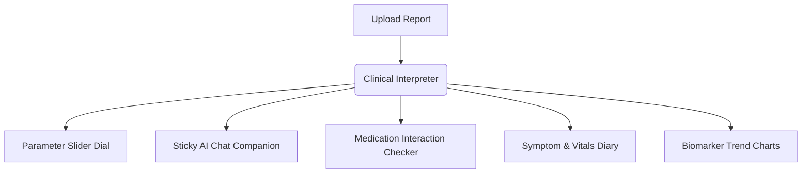

# MedIntel — A Simple Guide to Your Health Companion

Welcome to **MedIntel**! This guide is written for everyone. You do not need any background in medicine, computer science, or technology to understand how MedIntel works. 

Think of MedIntel as a **digital translator and helper for your health**. It takes complex documents from your doctor and translates them into plain, easy-to-read terms so you can take control of your well-being.

---

## 🌟 How It Works (The Big Picture)
Usually, when you leave a clinic, you are handed sheets of paper filled with numbers, abbreviations (like *MCV* or *HDL*), and doctor jargon. 
MedIntel takes these files, uses secure Artificial Intelligence to read them, and breaks them down into **six simple modules**:

---

## 📂 The Six Core Modules Explained

### 1. 📄 The Clinical Interpreter (Upload & Parse)
*   **What it does:** Reads your uploaded PDF reports or photos of medical sheets.
*   **Simple Analogy:** Like taking a book written in a foreign language and translating it instantly into your native tongue.
*   **Why it's helpful:** Instead of searching the web for hours trying to figure out what a word means, MedIntel gives you a clear **2-paragraph overall summary** of your report, highlighting exactly what is normal and what needs attention.

### 2. 📊 The Normal Range Dial (Parameter Breakdown)
*   **What it does:** Displays each lab measurement with a colored border and a visual slider.
*   **Simple Analogy:** Like the fuel gauge in your car. It doesn't just tell you how many gallons are left; it shows you if you are in the **Green (Safe)**, **Amber (Warning)**, or **Red (Empty/Action Required)** zones.
*   **Why it's helpful:** For every parameter (like Cholesterol or Hemoglobin), you see a horizontal bar with a marker showing exactly where your value sits. Underneath, it explains in normal language what that test means and gives you simple remedies (like drinking more water or adjusting diet).

### 3. 💬 Your Pocket AI Companion (Sticky Real-Time Chat)
*   **What it does:** A chat panel that sits right next to your report details.
*   **Simple Analogy:** Like sitting with a compassionate, friendly nurse who has your report in front of them and answers any follow-up question you type.
*   *How it helps:* You can ask, *"Why is my Hemoglobin high?"* or *"What food should I eat to improve this result?"* and receive immediate, easy-to-understand explanations.

### 💊 4. The Pill Planner (Medication Tracker)
*   **What it does:** Helps you log what medicines you take and checks for overlaps or issues.
*   **Simple Analogy:** A smart calendar alarm clock that knows how your pills talk to each other.
*   **Why it's helpful:** If you upload a prescription report, you can click one button to import all those pills. The system automatically warns you if two medications might react poorly with each other or if you missed a dose.

### 🩺 5. The Vitals Diary (Symptom Logger)
*   **What it does:** A simple page where you log how you feel daily (e.g., headaches, fatigue) along with basic vitals (e.g., blood pressure, sleep hours).
*   **Simple Analogy:** A digital health diary where you jot down daily entries.
*   **Why it's helpful:** Instead of trying to remember if you felt tired three weeks ago, you can log it in seconds. 

### 📈 6. The Progress Map (Trends & Timelines)
*   **What it does:** Combines all your uploaded reports, symptoms, and pills over months into interactive charts and timelines.
*   **Simple Analogy:** A time-lapse video of your health journey.
*   **Why it's helpful:** You can visually see if your cholesterol is going down over 6 months or compare two blood tests side-by-side. You can also print a **Doctor Summary Sheet** before your next checkup so your physician can see your logged history at a glance.

---

## 🔒 Security & Privacy (Keep It Safe)
Medical details are deeply personal. MedIntel treats your files like secure banking documents:
1.  **Fully Encrypted:** Your records are encrypted so only you can access them.
2.  **No Diagnostic Decisions:** MedIntel is a helper to explain reports, not replace doctors. It always prompts you on what points are worth discussing during your next clinic visit.
