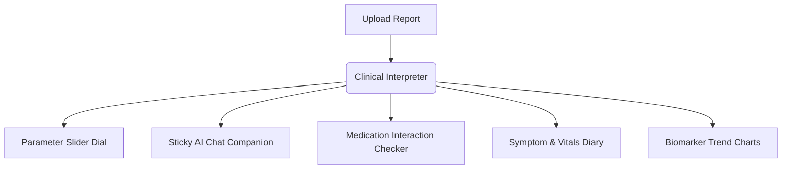
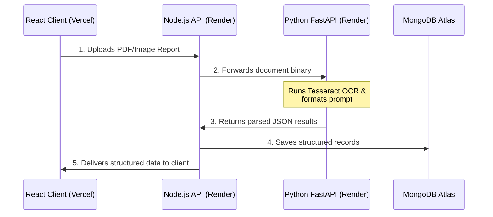

# MedIntel — A Simple Guide to Your Health Companion

Welcome to **MedIntel**! This guide is split into two sections:
1. **[Patient Guide](#patient-guide-simple-explanations)**: Written in plain, non-technical language for everyday users.
2. **[Technical Guide](#technical-guide-for-team-members)**: Written for team members to understand and explain how the system is built, its architecture, and its integrations.

---

## PATIENT GUIDE (Simple Explanations)

Think of MedIntel as a **digital translator and helper for your health**. It takes complex documents from your doctor and translates them into plain, easy-to-read terms so you can take control of your well-being.

### 🌟 How It Works (The Big Picture)
Usually, when you leave a clinic, you are handed sheets of paper filled with numbers, abbreviations (like *MCV* or *HDL*), and doctor jargon. 
MedIntel takes these files, uses secure Artificial Intelligence to read them, and breaks them down into **six simple modules**:

### 📂 The Six Core Modules Explained

#### 1. 📄 The Clinical Interpreter (Upload & Parse)
*   **What it does:** Reads your uploaded PDF reports or photos of medical sheets.
*   **Simple Analogy:** Like taking a book written in a foreign language and translating it instantly into your native tongue.
*   **Why it's helpful:** Instead of searching the web for hours trying to figure out what a word means, MedIntel gives you a clear **2-paragraph overall summary** of your report, highlighting exactly what is normal and what needs attention.

#### 2. 📊 The Normal Range Dial (Parameter Breakdown)
*   **What it does:** Displays each lab measurement with a colored border and a visual slider.
*   **Simple Analogy:** Like the fuel gauge in your car. It doesn't just tell you how many gallons are left; it shows you if you are in the **Green (Safe)**, **Amber (Warning)**, or **Red (Empty/Action Required)** zones.
*   **Why it's helpful:** For every parameter (like Cholesterol or Hemoglobin), you see a horizontal bar with a marker showing exactly where your value sits. Underneath, it explains in normal language what that test means and gives you simple remedies.

#### 3. 💬 Your Pocket AI Companion (Sticky Real-Time Chat)
*   **What it does:** A chat panel that sits right next to your report details.
*   **Simple Analogy:** Like sitting with a compassionate, friendly nurse who has your report in front of them and answers any follow-up question you type.
*   **Why it's helpful:** You can ask, *"Why is my Hemoglobin high?"* or *"What food should I eat to improve this result?"* and receive immediate, easy-to-understand explanations.

#### 💊 4. The Pill Planner (Medication Tracker)
*   **What it does:** Helps you log what medicines you take and checks for overlaps or issues.
*   **Simple Analogy:** A smart calendar alarm clock that knows how your pills talk to each other.
*   **Why it's helpful:** If you upload a prescription report, you can click one button to import all those pills. The system automatically warns you if two medications might react poorly with each other or if you missed a dose.

#### 🩺 5. The Vitals Diary (Symptom Logger)
*   **What it does:** A simple page where you log how you feel daily (e.g., headaches, fatigue) along with basic vitals (e.g., blood pressure, sleep hours).
*   **Simple Analogy:** A digital health diary where you jot down daily entries.
*   **Why it's helpful:** Instead of trying to remember if you felt tired three weeks ago, you can log it in seconds. 

#### 📈 6. The Progress Map (Trends & Timelines)
*   **What it does:** Combines all your uploaded reports, symptoms, and pills over months into interactive charts and timelines.
*   **Simple Analogy:** A time-lapse video of your health journey.
*   **Why it's helpful:** You can visually see if your cholesterol is going down over 6 months or compare two blood tests side-by-side. You can also print a **Doctor Summary Sheet** before your next checkup so your physician can see your logged history at a glance.

---

## TECHNICAL GUIDE (For Team Members)

This section provides technical details regarding MedIntel's microservices architecture and integration keys to help team members explain the system to stakeholders, developers, or clients.

### 🏗️ System Architecture & Services
MedIntel is built using a decoupled **three-tier architecture**:

#### 1. Frontend Client (React + Vite)
*   **Role:** The user-facing Single Page Application (SPA).
*   **Hosting:** Deployed on **Vercel** with custom client-side path routing rewrites.
*   **Key Libs:** 
    *   `react-router-dom` for application navigation.
    *   `recharts` for rendering patient biomarker trend graphs.
    *   `lucide-react` for responsive icon grids.
    *   `react-dropzone` for handling drag-and-drop file transfers.
*   **Failsafe Feature:** Includes capturing-phase window listeners that catch stale asset chunk load failures (which happen if the app redeploys while a user has an active tab open) and trigger a silent reload to resolve MIME-type errors.

#### 2. Backend Coordinator (Node.js + Express)
*   **Role:** The core orchestrator. Handles user data, routes, cron tasks, and security.
*   **Hosting:** Deployed on **Render** (Node environment).
*   **Database:** **MongoDB Atlas** (Mongoose ODM) storing user profiles, analyzed parameters, and medication reminders.
*   **Core Responsibilities:**
    *   Handles JWT authentication (pre-verified registration, login, token rotations).
    *   Orchestrates medication interaction checkers using a rules-engine middleware.
    *   Manages background timers (`node-cron`) to track daily dose adherence and flag missed medication intakes.

#### 3. AI Processing Microservice (Python + FastAPI)
*   **Role:** The clinical extraction engine.
*   **Hosting:** Deployed on **Render** (Docker environment). Docker is used to bundle the system-level binary dependency **`tesseract-ocr`** (needed for image text scanning).
*   **Core Responsibilities:**
    *   Receives PDFs or JPEGs, executes text extraction (PDF text extraction with PyMuPDF, falls back to OCR via Tesseract for scanned images).
    *   Validates outputs against strict JSON structures.

---

### 🔑 External API Integrations & Key Behaviors

To function, the backend and AI services use several external APIs. Here is how they work:

| API / Service Key | Service Provider | Who Uses It? | How It Works & What It Does |
| :--- | :--- | :--- | :--- |
| **`GROQ_API_KEY`** | Groq | Backend & AI Service | **Primary AI Engine:** Sends report text to Llama-3 models. Groq's high-speed inference provides sub-second responses for patient-friendly breakdowns, translation, and Q&A chat. |
| **`GEMINI_API_KEY`** | Google AI | Backend & AI Service | **AI Fallback:** If Groq's rate limits are exceeded or the PDF text is too long (over model context limits), the code automatically switches to `gemini-1.5-flash` to process the data securely. |
| **`BREVO_API_KEY`** | Brevo (SMTP) | Node Backend | **Communications:** Triggers transactional emails. It sends welcome/onboarding emails (customized with HTML templates), password reset tokens, and schedules weekly summary reports. |
| **`ONESIGNAL_APP_ID` & `ONESIGNAL_API_KEY`** | OneSignal | Node Backend & React Client | **Push Notifications:** Automatically registers users during signup. It pushes alerts to patient devices (like medication reminders, confirmation alerts, and missed dose notices). |
| **`CLOUDINARY_URL`** | Cloudinary | Node Backend | **File Hosting:** Securely stores uploaded PDF/image medical reports, generating encrypted URLs that the backend saves in MongoDB. |
